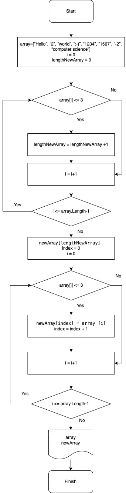

## Итоговая проверочная работа.

### Схема алгоритма 

### Описание решения
1. Задаем массив из строковых элементов разной длины.

2. Проверяем каждый элемент массива на количество символов  по условию "длина символов <= 3" и в случае соответствия добавляем значение 1 в переменную length - таким образом узнаем количество элементов нового массива. 

3. Обьявляем новый массив с количеством элементов length. проверяем если элемент первого массива менее 3 символов то присваиваем новому массиву элемент с индексом index. Увеличиваем index на 1 и продолжаем прооверку до последнего элемента первого массива.